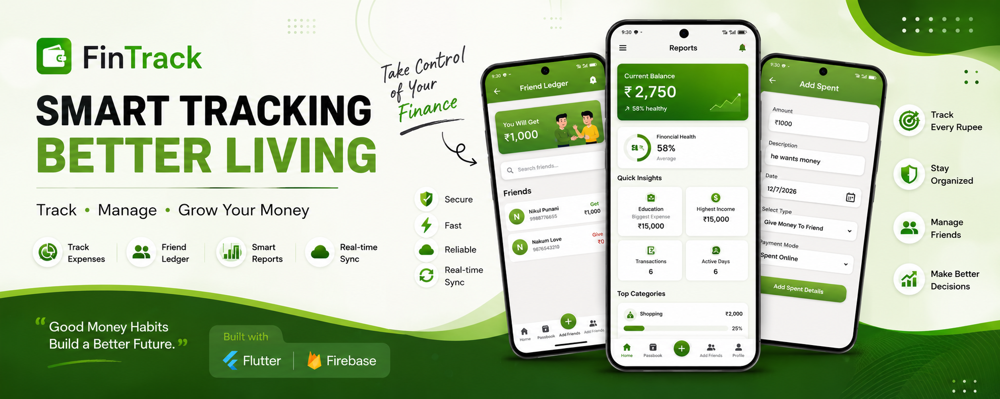
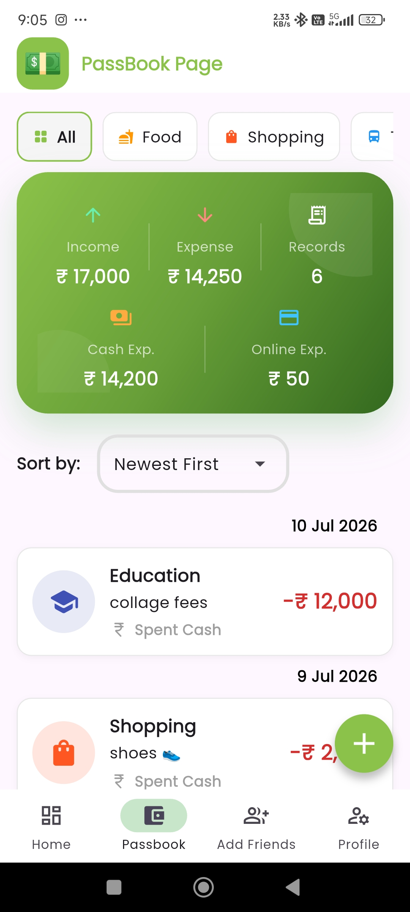
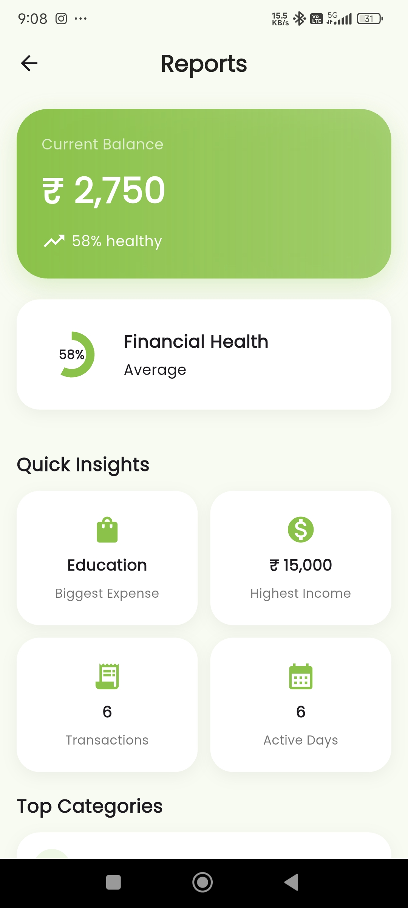
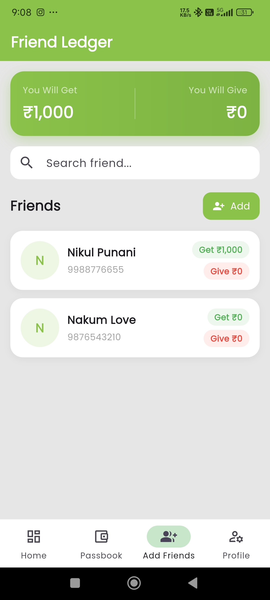
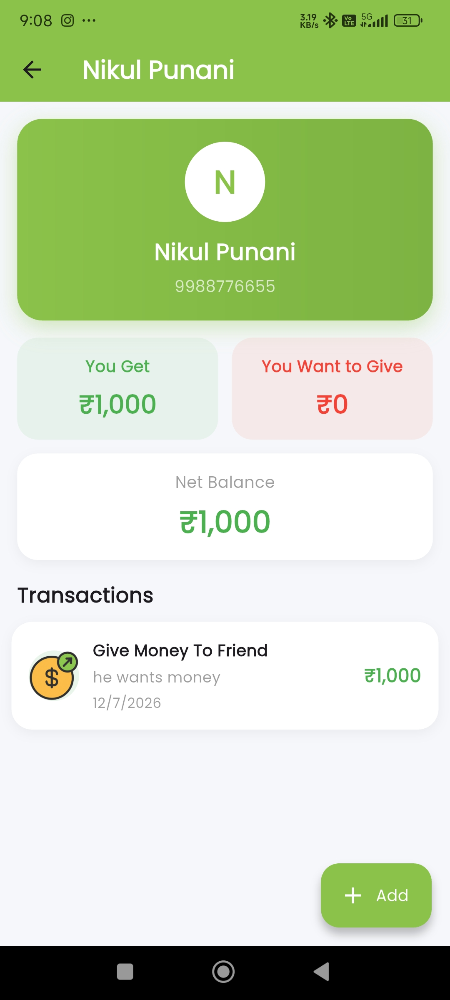
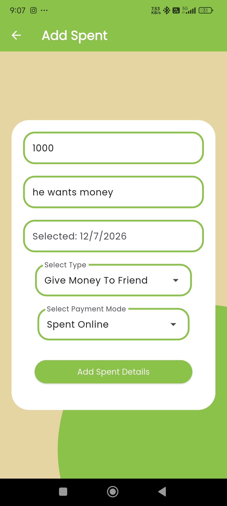

<!-- ========================================================= -->
<!--                     FINTRACK README                        -->
<!-- ========================================================= -->

<p align="center">



</p>

<h1 align="center">
💚 FinTrack
</h1>

<p align="center">
<b>Smart Expense Tracker • Friend Ledger • Financial Insights</b>
</p>

<p align="center">
  
</p>

<p align="center">
  
  
  
  
  
</p>
---

# ✨ Overview

**FinTrack** is a beautifully designed personal finance application built using **Flutter** and **Firebase Realtime Database**.

It helps users effortlessly:

- 💰 Track Income
- 💸 Manage Expenses
- 📒 Maintain Passbook
- 👥 Handle Friend Ledger
- 📊 View Financial Reports
- ☁ Real-Time Cloud Sync
- 📅 Daily Transaction History

---

# 🎥 Demo

<p align="center">

> Add a demo GIF here


</p>

---

# 📱 Screenshots

<table align="center">
<tr>
<td align="center">
<h2>🏠 Home</h2>

</td>

<td align="center">
<h2>📒 Passbook</h2>

</td>

<td align="center">
<h2>📊 Reports</h2>

</td>
</tr>

<tr>
<td align="center">
<h2>👥 Friend Ledger</h2>

</td>

<td align="center">
<h2>👤 Friend Details</h2>

</td>

<td align="center">
<h2>➕ Add Expense</h2>

</td>
</tr>
</table>


# 🌟 Features

### 💰 Expense Management

- Add Income
- Add Expenses
- Cash Transactions
- Online Transactions

---

### 📒 Passbook

- Category Filter
- Search
- Sort
- Date Wise Records

---

### 👥 Friend Ledger

- Add Friends
- Money You Get
- Money You Give
- Net Balance
- Individual History

---

### 📊 Reports

- Financial Health
- Current Balance
- Top Categories
- Highest Expense
- Highest Income
- Transaction Count
- Active Days

---

### ☁ Firebase

- Realtime Database
- Live Synchronization

---

# 🚀 Tech Stack

| Technology | Usage |
|------------|------|
| Flutter | UI Development |
| Dart | Programming Language |
| Firebase Realtime DB | Cloud Database |
| Shared Preferences | Local Storage |
| Material 3 | UI Components |

---

# 📂 Project Structure

```text
lib
│
├── main.dart
├── nav_bar.dart
├── firebase_options.dart
│
├── authantication
│   ├── login_page.dart
│   └── registration_page.dart
│
├── splash
│   └── splash_page.dart
│
├── user_pages
│   ├── main_page.dart
│   ├── add_spent.dart
│   ├── PassbookPage.dart
│   ├── NewPassbookPage.dart
│   └── profile.dart
│
├── FriendsPages
│   ├── addFriends.dart
│   ├── addFriendSpent.dart
│   ├── friend_expenses.dart
│   └── specificFriendPage.dart
│
├── ProfilePages
│   ├── PersonalInformationPage.dart
│   ├── EditInformationPage.dart
│   ├── ChangePasswordPage.dart
│   ├── FeedbackPage.dart
│   ├── ReportPage.dart
│   └── try.dart
│
└── GetInformation
    ├── GetAllInformation.dart
    ├── GetAllRecords.dart
    ├── GetFriendDetails.dart
    ├── GetSpecificFriendDetails.dart
    ├── GetTotalExpenses.dart
    ├── GetTotalFriendExpenses.dart
    ├── GetInformationForProfile.dart
    ├── GetUserDetail.dart
    └── HashPassword.dart

```

---

# 🏗 Architecture

```text
                Flutter UI
                     │
                     ▼
             Business Logic
                     │
        ┌────────────┴────────────┐
        ▼                         ▼
 SharedPreferences       Firebase Realtime DB
        │                         │
        └────────────┬────────────┘
                     ▼
                Live Synchronization
```

---

# 🗂 Firebase Structure

```text
user_details
   └── phone_number
          ├── username
          ├── email
          └── ...

Expenses
   └── phone_number
          ├── record_1
          ├── record_2
          └── ...

Friends
   └── phone_number
          ├── friend_number
          │      ├── Details
          │      └── Records
          └── ...
```

---

# 📈 App Modules

- 🏠 Dashboard
- 📒 Passbook
- ➕ Add Expense
- 👥 Friend Ledger
- 📊 Reports
- 👤 Profile

---

# 🎨 UI Highlights

✅ Material Design 3

✅ Soft Green Theme

✅ Responsive Layout

✅ Modern Cards

✅ Smooth Navigation

✅ Financial Dashboard

---

# ⚡ Installation

Clone Repository

```bash
git clone https://github.com/VishalNakum1210/FinTrack.git
```

Go into project

```bash
cd FinTrack
```

Install packages

```bash
flutter pub get
```

Run application

```bash
flutter run
```

---

# 📋 Requirements

- Flutter 3.44+
- Dart 3+
- Android Studio / VS Code
- Firebase Project
- Android SDK

---

# 🛣 Roadmap

- [x] Expense Tracking
- [x] Income Management
- [x] Friend Ledger
- [x] Reports
- [x] Firebase Sync
- [ ] Monthly Budget
- [ ] PDF Export
- [ ] Excel Export
- [ ] Notifications
- [ ] Dark Mode
- [ ] AI Insights

---

# 📊 Project Stats

| Module | Status |
|----------|---------|
| Dashboard | ✅ |
| Passbook | ✅ |
| Reports | ✅ |
| Friend Ledger | ✅ |
| Firebase | ✅ |
| Profile | ✅ |

---


# 👨‍💻 Developer

<p align="center">

## Vishal Nakum

Flutter Developer • Firebase Enthusiast

📧 vishal7228918826@gmail.com

🌐 https://github.com/VishalNakum1210

</p>

---

<div align="center">

<h2>🌟 Show Your Support</h2>

<p>If you found this project useful, please consider giving it a ⭐ on GitHub!</p>

<a href="https://github.com/VishalNakum1210/FinTrack">
  
</a>

</div>

---

<p align="center">

Made with ❤️ using Flutter

</p>