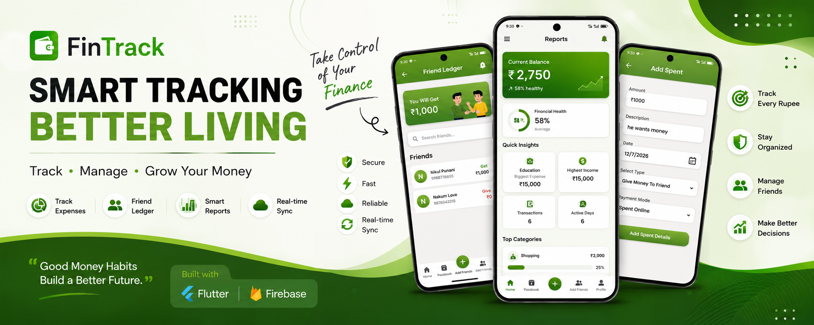
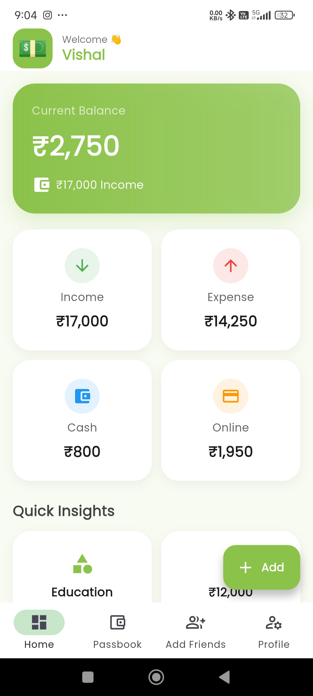
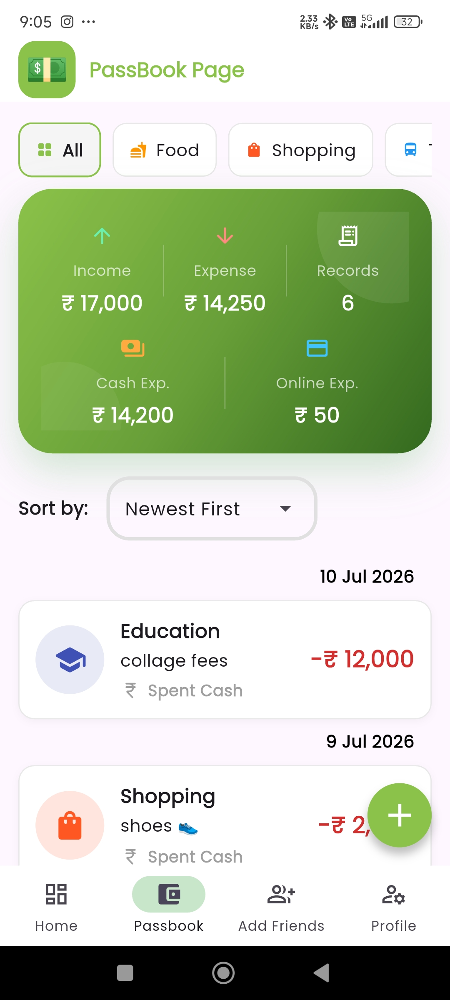
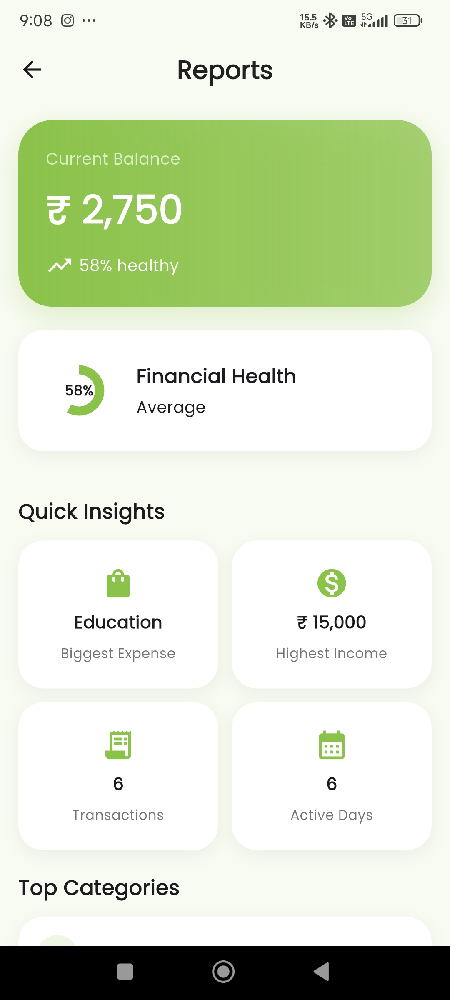
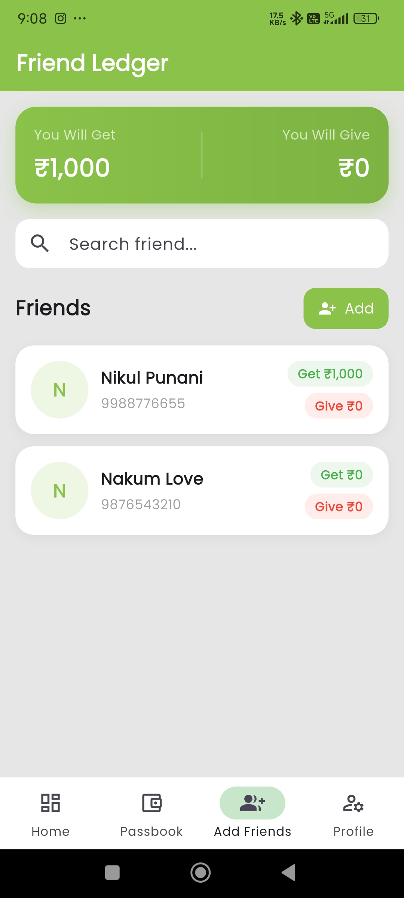
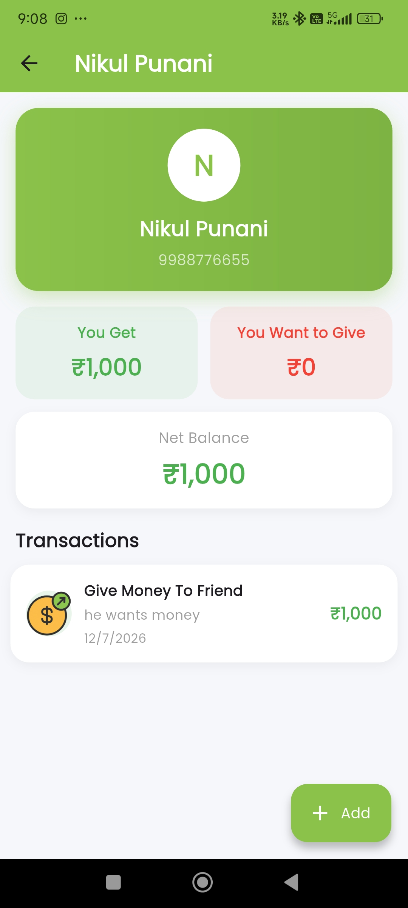
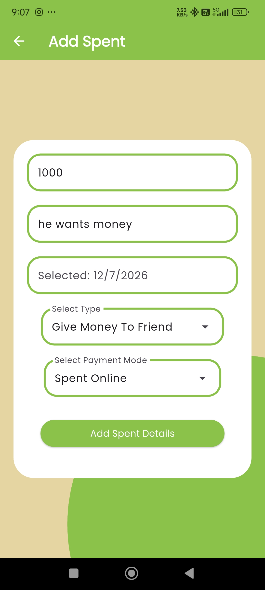

<!-- ========================================================= -->
<!--                     FINTRACK README                        -->
<!-- ========================================================= -->

<p align="center">
  
</p>

<h1 align="center">
  💚 FinTrack
</h1>

<p align="center">
  <b>Smart Expense Tracker • Friend Ledger • Financial Insights • Bill Splitting</b>
</p>

<p align="center">
  
</p>

<p align="center">
  
  
  
  
  
  
</p>

---

# ✨ Overview

**FinTrack** is a secure, high-performance personal finance application built using **Flutter** and **Firebase Realtime Database**. Designed with Material Design 3 and a clean green palette, it empowers users to seamlessly track day-to-day spending, maintain double-entry friend ledgers, split bills atomically across multiple friends, and generate printable PDF financial statements.

- 💰 **Personal Expense Tracker**: Record cash and online expenses/incomes across categories.
- 📒 **Smart Passbook**: Paginated, filterable, and sortable transaction passbook.
- 👥 **Friend Ledger**: Real-time mutual debt and credit tracking with in-line edit capabilities.
- 🍕 **Multi-Friend Bill Splitting**: Atomically distribute bills across multiple friends with automatic passbook and ledger updates.
- 📄 **PDF Statements**: Vector PDF export for monthly passbooks and individual friend statements.
- 📊 **Visual Analytics**: Interactive category breakdown charts, health scores, and financial metrics.
- 🔒 **Security First**: 1,000-round salted HMAC-SHA256 password hashing, hardware Keystore encrypted sessions, and brute-force throttling.

---

# 📱 Screenshots

<table align="center">
<tr>
<td align="center">
<h3>🏠 Home</h3>

</td>

<td align="center">
<h3>📒 Passbook</h3>

</td>

<td align="center">
<h3>📊 Reports</h3>

</td>
</tr>

<tr>
<td align="center">
<h3>👥 Friend Ledger</h3>

</td>

<td align="center">
<h3>👤 Friend Details</h3>

</td>

<td align="center">
<h3>➕ Add Expense</h3>

</td>
</tr>
</table>

---

# 🌟 Features

### 💰 Expense & Income Tracking
- Record transactions with customizable categories (Food, Shopping, Transport, Healthcare, etc.).
- Differentiate between **Cash** and **Online** payments.
- Real-time balance recalculation with 10MB offline disk persistence.

### 📒 Paginated Passbook
- Instant category chip filtering with dynamic color coding.
- Pre-parsed chronological sorting (Newest / Oldest First) without UI jank.
- 50-item paginated chunks with smooth "Load More" controls.
- Pull-to-refresh synchronization and dedicated network retry widgets.

### 👥 Friend Ledger & Debt Management
- Keep track of **"You Get"** and **"You Give"** ledger balances.
- Live real-time streaming listeners for friend balance updates.
- Long-press any transaction to edit amounts or descriptions with atomic ledger adjustment.
- Export itemized PDF statements directly from the friend screen.

### 🍕 Group Bill Splitter
- Split expenses evenly among multiple friends in a single atomic transaction.
- Simultaneously logs your personal share into your Passbook and each friend's share into their respective ledger.

### 📄 PDF Generation
- Generate vector PDF account statements with transaction tables, category summaries, and current balance badges.
- Native Android print/share sheet integration powered by `package:printing`.

### 📊 Reports & Analytics
- Monthly, yearly, and all-time financial health score calculations.
- Interactive category expense breakdown with pie charts powered by `package:fl_chart`.
- Identification of biggest spending category and peak single transactions.

---

# 🛡 Security & Privacy

FinTrack incorporates production-grade security practices:
- **Salted Key Stretching**: Passwords are protected using 1,000-round HMAC-SHA256 (`v3_` prefix) combined with unique phone-number salts and application secrets.
- **Off-Thread Crypto**: Password hashing and verification run in dedicated `compute()` background isolates to eliminate UI freezes.
- **Hardware-Backed Storage**: Auth credentials and signatures are stored in `FlutterSecureStorage` using Android Keystore / iOS Keychain.
- **Brute-Force Protection**: 5-attempt throttle lockout on both login and registration to safeguard against automated credential stuffing.
- **Database Rules**: Node-level validation and authenticated authorization rules ensuring user records cannot be read or modified by unauthorized clients.

---

# 🚀 Tech Stack

| Technology | Purpose |
|---|---|
| **Flutter 3.x** | Cross-platform UI toolkit |
| **Dart 3.x** | Programming language |
| **Firebase Realtime Database** | Cloud database with live stream subscriptions and disk persistence |
| **Firebase Auth** | Anonymous session token provider for security rule verification |
| **Provider** | Centralized reactive state management (`ExpenseProvider`, `FriendProvider`, `UserProvider`) |
| **FlutterSecureStorage** | Encrypted local storage via Android Keystore |
| **FL Chart** | Interactive financial charts and analytics |
| **PDF & Printing** | Document generation and sharing |
| **Crypto** | HMAC-SHA256 key stretching and session integrity signatures |

---

# 📂 Project Structure

```text
lib/
├── main.dart                          # App entrypoint, Firebase init, offline cache
├── nav_bar.dart                       # Bottom navigation with PopScope back-button handling
├── firebase_options.dart              # FlutterFire platform configuration
│
├── authentication/                    # User authentication
│   ├── login_page.dart                # Login screen with brute-force lockout
│   └── registration_page.dart         # User registration with password complexity policy
│
├── splash/                            # Splash screen
│   └── splash_page.dart               # Splash display with parallel session verification
│
├── user_pages/                        # Main user screens
│   ├── main_page.dart                 # Dashboard, quick stats, recent transactions
│   ├── passbook_page.dart             # Paginated passbook, search, category filter
│   ├── add_spent.dart                 # Add transaction modal & single bill split
│   └── profile.dart                   # Account settings, summary, logout dialogs
│
├── friends_pages/                     # Friends & ledger management
│   ├── friend_expenses.dart           # Friends list, net balance summary, split bill action
│   ├── specific_friend_page.dart      # Real-time friend ledger with edit/delete & PDF export
│   ├── add_friends.dart               # Add friend modal
│   ├── add_friend_spent.dart          # Add transaction to friend ledger
│   └── split_bill_page.dart           # Multi-friend atomic bill splitter
│
├── profile_pages/                     # Profile & settings screens
│   ├── personal_information_page.dart # User profile overview
│   ├── edit_information_page.dart     # Edit name, email, and address
│   ├── change_password_page.dart      # Old password validation & update flow
│   ├── report_page.dart               # Financial health analytics & FL Chart breakdown
│   └── feedback_page.dart             # Feedback and bug report submission
│
├── providers/                         # Reactive State Management (ChangeNotifiers)
│   ├── expense_provider.dart          # Expense stream, balance math, CRUD actions
│   ├── friend_provider.dart           # Friend ledger stream, atomic transactions & splits
│   └── user_provider.dart             # User profile session and updates
│
├── services/                          # External services
│   └── export_service.dart            # Vector PDF statement builder
│
├── utils/                             # Shared helpers
│   ├── category_theme.dart            # Category color schemes & icons
│   ├── currency_helper.dart           # Standard INR currency formatters
│   └── date_helper.dart               # High-performance zero-exception date parsing
│
└── widgets/                           # Reusable UI components
    ├── confirm_dialog.dart            # Modal confirmation dialog
    ├── error_retry_widget.dart        # Connection failure state with retry button
    └── insight_card.dart              # Dashboard metric cards
```

---

# 📦 Release APK Downloads

Pre-built, signed production APKs are located under `build/app/outputs/flutter-apk/`:

| Package | Target | Size | Description |
|---|---|---|---|
| **`app-arm64-v8a-release.apk`** | Modern 64-bit Android | **~21 MB** | **Recommended.** Optimized for 99% of modern smartphones. |
| **`app-release.apk`** | Universal | **~57 MB** | Works on any Android architecture. |
| **`app-armeabi-v7a-release.apk`** | 32-bit Android | **~19 MB** | For older legacy devices. |

### 📲 How to Install Directly on Android:
1. Download `app-arm64-v8a-release.apk` to your phone.
2. Tap the downloaded APK in your file manager or browser.
3. If prompted, allow **"Install unknown apps"** for your file browser.
4. Tap **Install** and launch FinTrack!

---

# ⚡ Getting Started (Developers)

### Prerequisites
- [Flutter SDK](https://docs.flutter.dev/get-started/install) (version 3.24+ recommended)
- Android Studio / VS Code with Flutter extension
- Firebase project with Realtime Database and Anonymous Authentication enabled

### Installation
1. **Clone the repository:**
   ```bash
   git clone https://github.com/VishalNakum1210/FinTrack.git
   cd FinTrack
   ```

2. **Install dependencies:**
   ```bash
   flutter pub get
   ```

3. **Run static analysis:**
   ```bash
   flutter analyze
   ```

4. **Execute test suite:**
   ```bash
   flutter test
   ```

5. **Run the app in debug mode:**
   ```bash
   flutter run
   ```

6. **Build release APK:**
   ```bash
   flutter build apk --release --split-per-abi
   ```

---

# 🛣 Roadmap

- [x] Personal Income & Expense Tracking
- [x] Real-time Database Streaming
- [x] Double-entry Friend Ledger
- [x] Multi-friend Bill Splitting
- [x] Vector PDF Statement Export
- [x] Hardware Keystore Encrypted Sessions
- [x] Salted 1,000-Round Password Hashing
- [x] Offline Disk Persistence (10MB cache)
- [x] Pull-to-Refresh & Network Retry States
- [ ] Monthly Budget Limits & Over-budget Alerts
- [ ] SMS / Transaction Auto-detection
- [ ] Excel / CSV Statement Export
- [ ] Dark Mode Theme Support

---

# 👨‍💻 Developer

<p align="center">
  <b>Vishal Nakum</b><br>
  Flutter Developer • Firebase Enthusiast<br>
  📧 <a href="mailto:vishal7228918826@gmail.com">vishal7228918826@gmail.com</a><br>
  🌐 <a href="https://github.com/VishalNakum1210">github.com/VishalNakum1210</a>
</p>

---

<div align="center">
  <h2>🌟 Show Your Support</h2>
  <p>If you find this project helpful, please give it a ⭐️ on GitHub!</p>
  <a href="https://github.com/VishalNakum1210/FinTrack">
    
  </a>
</div>

<br>

<p align="center">
  Made with 💚 using Flutter
</p>
