<!-- ================================================================= -->
<!--                         FINTRACK README                           -->
<!-- ================================================================= -->

<p align="center">
  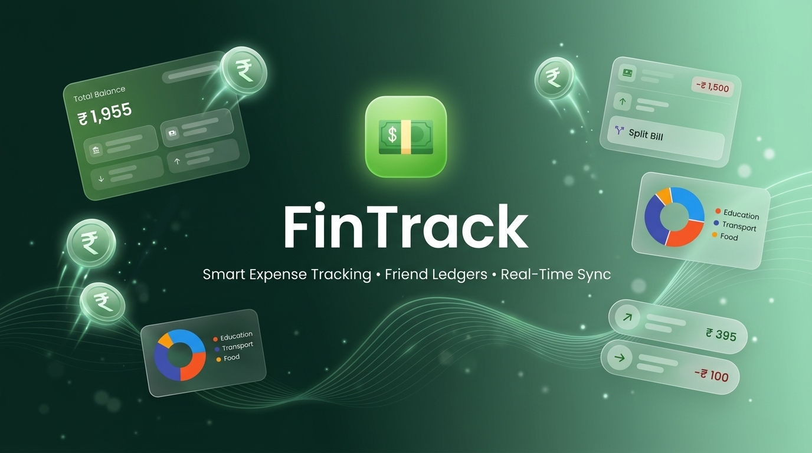
</p>

<div align="center">

  <h1>💚 FinTrack</h1>
  <h3>Smart Expense Tracking • Friend Ledger • Financial Insights • Bill Splitting</h3>

  <p>
    <a href="https://flutter.dev"></a>
    <a href="https://dart.dev"></a>
    <a href="https://firebase.google.com"></a>
    
    
    
    
  </p>

  <p>
    
  </p>

</div>

---

## 📑 Table of Contents

- [✨ Overview](#-overview)
- [📸 App Screenshots](#-app-screenshots)
- [🌟 Key Features](#-key-features)
  - [1. Dual-Wallet Personal Expense & Income Tracker](#1-dual-wallet-personal-expense--income-tracker)
  - [2. Chronological Passbook & Statement](#2-chronological-passbook--statement)
  - [3. Double-Entry Friend Ledger](#3-double-entry-friend-ledger)
  - [4. Multi-Friend Atomic Bill Splitter](#4-multi-friend-atomic-bill-splitter)
  - [5. Visual Analytics & Financial Health Reports](#5-visual-analytics--financial-health-reports)
  - [6. Multi-Format Data Export & Backup Engine](#6-multi-format-data-export--backup-engine)
  - [7. Hardware-Backed Security & Offline Architecture](#7-hardware-backed-security--offline-architecture)
  - [8. User Profile & Feedback System](#8-user-profile--feedback-system)
- [🏗 Architecture & Flow Diagrams](#-architecture--flow-diagrams)
  - [System Architecture](#system-architecture)
  - [User Journey & Navigation Flow](#user-journey--navigation-flow)
  - [Atomic Bill Splitting Data Flow](#atomic-bill-splitting-data-flow)
  - [Security & Authentication Lifecycle](#security--authentication-lifecycle)
- [📂 Project Directory Structure](#-project-directory-structure)
- [🚀 Tech Stack & Dependencies](#-tech-stack--dependencies)
- [⚡ Getting Started](#-getting-started)
  - [Prerequisites](#prerequisites)
  - [Installation & Setup](#installation--setup)
  - [Firebase Setup](#firebase-setup)
- [🧪 Testing & Quality Assurance](#-testing--quality-assurance)
- [📦 Production APK Downloads](#-production-apk-downloads)
- [🛡 Security Best Practices](#-security-best-practices)
- [👨‍💻 Author & Contributions](#-author--contributions)

---

## ✨ Overview

**FinTrack** is an enterprise-grade, high-performance personal finance and shared expense ledger mobile application built with **Flutter** and **Firebase Realtime Database**. Engineered following modern clean architecture and Google's Material Design 3 guidelines, FinTrack bridges the gap between individual budgeting and social expense splitting.

Unlike standard expense apps that only count what you spend, FinTrack incorporates a **double-entry ledger engine** for friends and group outings, **atomic bill-splitting transactions**, **interactive data visualization**, and **hardware-backed session encryption** ensuring zero data loss even in low or absent network conditions.

> [!TIP]
> FinTrack runs completely offline with automatic sync! All transactions made while offline are saved to disk (up to 10 MB) and synchronized instantaneously with Firebase Realtime Database once connectivity is restored.

---

## 📸 App Screenshots

<table align="center" width="100%">
  <tr>
    <td align="center" width="20%">
      <b>01. Splash & Branding</b><br><br>
      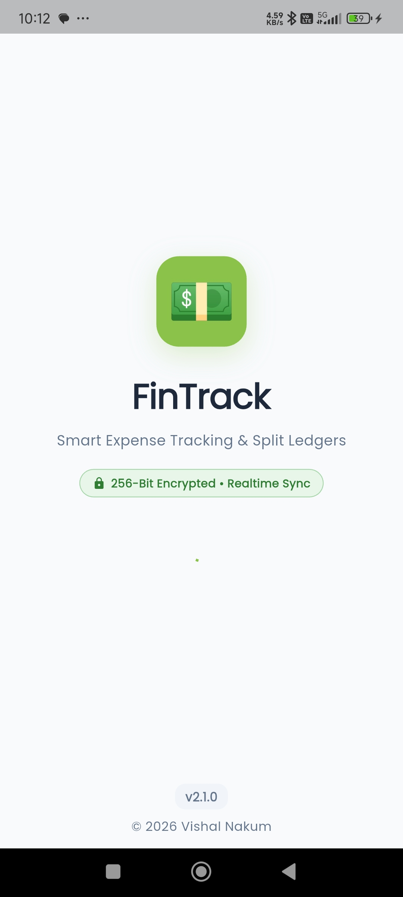<br>
      <sub><i>Fast boot with session integrity check</i></sub>
    </td>
    <td align="center" width="20%">
      <b>02. Home Dashboard</b><br><br>
      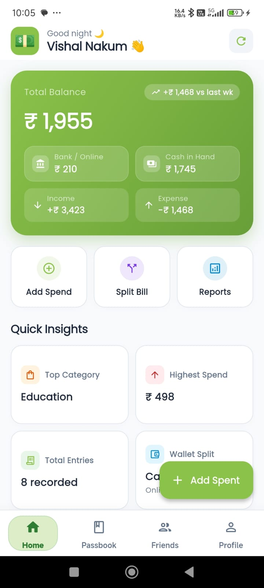<br>
      <sub><i>Dual wallet balance & Quick Insights</i></sub>
    </td>
    <td align="center" width="20%">
      <b>03. Passbook Statement</b><br><br>
      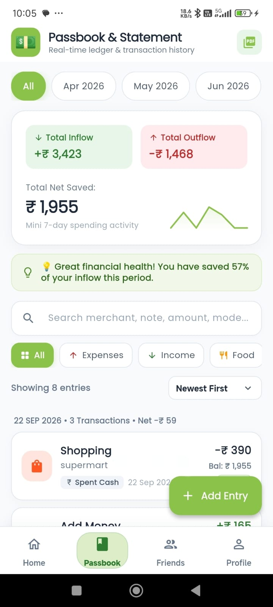<br>
      <sub><i>Sparkline trend, filters & edit pills</i></sub>
    </td>
    <td align="center" width="20%">
      <b>04. Friends Ledger</b><br><br>
      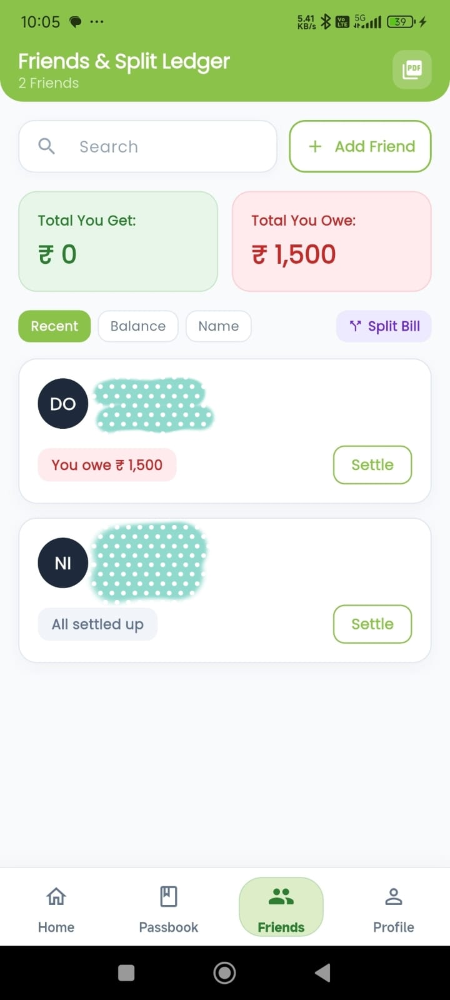<br>
      <sub><i>"You Get" vs "You Owe" summary</i></sub>
    </td>
    <td align="center" width="20%">
      <b>05. Reports: Overview</b><br><br>
      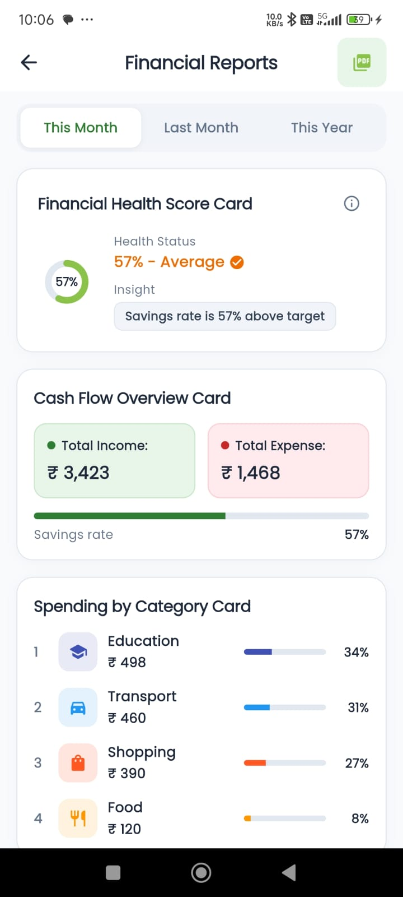<br>
      <sub><i>Health Score & Category breakdown</i></sub>
    </td>
  </tr>
  <tr>
    <td align="center" width="20%">
      <b>06. Reports: Visual Charts</b><br><br>
      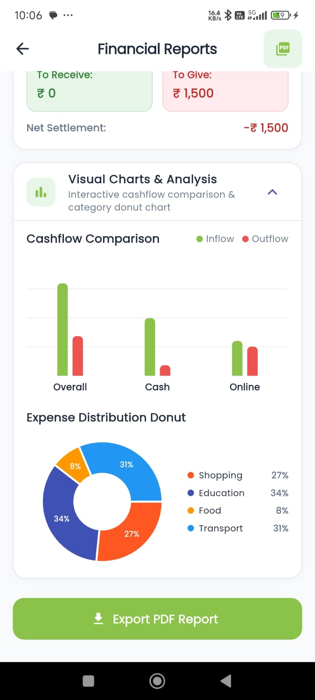<br>
      <sub><i>Cashflow bars & Donut chart analytics</i></sub>
    </td>
    <td align="center" width="20%">
      <b>07. Profile & Settings</b><br><br>
      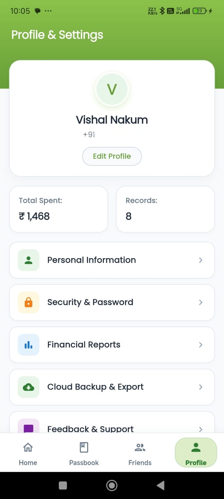<br>
      <sub><i>Account stats, sync & preferences</i></sub>
    </td>
    <td align="center" width="20%">
      <b>08. Personal Information</b><br><br>
      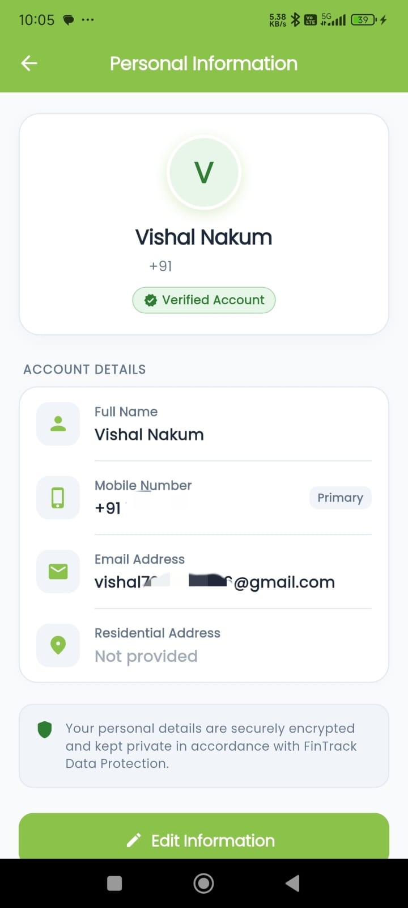<br>
      <sub><i>Encrypted identity & detail editing</i></sub>
    </td>
    <td align="center" width="20%">
      <b>09. Cloud Backup & Export</b><br><br>
      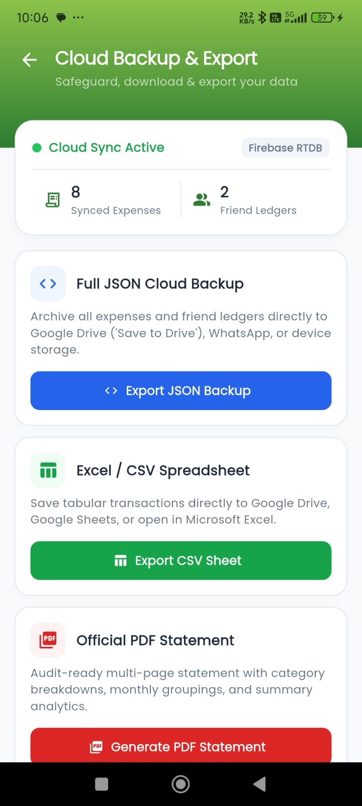<br>
      <sub><i>JSON snapshot, CSV & PDF statements</i></sub>
    </td>
    <td align="center" width="20%">
      <b>10. Feedback & Support</b><br><br>
      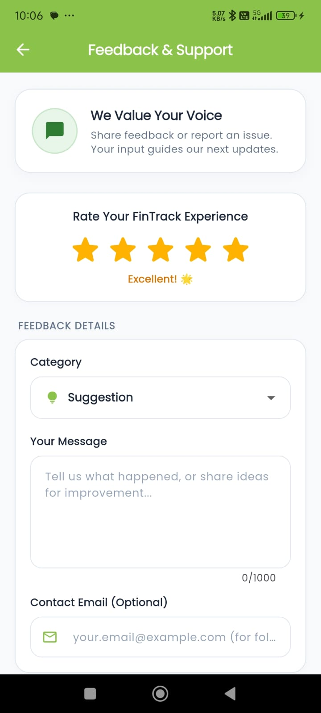<br>
      <sub><i>5-Star rating & priority issue sync</i></sub>
    </td>
  </tr>
</table>

---

## 🌟 Key Features

### 1. Dual-Wallet Personal Expense & Income Tracker
- **Smart Wallet Separation**: Differentiates between liquid **Cash in Hand** and **Bank / Online** balances for accurate cashflow reconciliation.
- **Categorization Engine**: Comprehensive pre-configured categories with distinct thematic colors and icon mappings (Food, Groceries, Shopping, Transport, Fuel, Entertainment, Healthcare, Bills, Education, Salary, Business, Investment, etc.).
- **Smart Insights**: Computes Top Spending Category, Highest Single Outflow, and Total Entry counts in real-time.
- **Dual Flow Quick Cards**: Real-time monthly Inflow (+Income) and Outflow (-Expense) summaries with delta comparisons against previous periods.

### 2. Chronological Passbook & Statement
- **Sparkline Trajectory**: Interactive canvas sparkline visualizer showing financial trends and savings peaks over time.
- **Dynamic Filtering Chips**: Filter by **All**, **Bank/Online**, or **Cash**, or drill down into specific spending categories with one touch.
- **Zero-Jank Chronological Sorting**: High-performance sorting (Newest to Oldest or Oldest to Newest) using pre-parsed dates.
- **Inline Transaction Editing & Deletion**: Long-press or tap Edit to update amounts, notes, dates, payment modes, or categories. Safe confirmation modals prevent accidental data loss.
- **Month Carousel**: Jump between any past month or year seamlessly.

### 3. Double-Entry Friend Ledger
- **Mutual Debt Tracking**: Keep tabs on debts across contacts with explicit **"You Get"** (green) and **"You Owe"** (red) balance cards.
- **Real-Time Streaming Listeners**: Realtime Database stream subscriptions automatically reflect balance changes as transactions occur.
- **Individual Ledger Statements**: View dedicated transaction histories with any specific friend, log repayments, or generate a tailored friend PDF statement.

### 4. Multi-Friend Atomic Bill Splitter
- **Group Outings & Dinners**: Split any bill equally across multiple friends in a single transaction.
- **Atomic Double-Entry Dispatch**: Automatically calculates individual shares, logs your personal portion in your Passbook, and credits or debits each friend's ledger simultaneously.
- **Zero Inconsistencies**: Guarantees that personal spending and friend obligations remain strictly in sync.

### 5. Visual Analytics & Financial Health Reports
- **Financial Health Score (0–100%)**: Algorithmic scoring that evaluates your monthly savings-to-income ratio, providing immediate feedback on financial discipline.
- **Visual Cashflow Comparison**: Side-by-side grouped bar charts comparing monthly income vs. expenses powered by `fl_chart`.
- **Category Distribution Donut Chart**: Interactive donut chart displaying proportional expenditure across all active categories.
- **Multi-Scope Reporting**: Filter analytics by **This Month**, **This Year**, or **All Time**.

### 6. Multi-Format Data Export & Backup Engine
- **📄 Vector PDF Statements**: Clean, professional printable statements generated via `pdf` and `printing` with summary banners, categorized tables, and balance metrics.
- **📊 CSV Spreadsheet Export**: Standard tabular export compatible with Microsoft Excel, Apple Numbers, and Google Sheets for audit and tax purposes.
- **💾 JSON Cloud Snapshot**: Full hierarchical backup of all user accounts, transactions, and friend ledgers for safe archiving and migration.

### 7. Hardware-Backed Security & Offline Architecture
- **Salted Password Hashing**: Passwords protected by **1,000-Round HMAC-SHA256** key stretching with unique telephone number salts and static secret peppers.
- **Isolate-Offloaded Crypto**: Heavy cryptographic hashing runs on dedicated Dart `compute()` background threads to guarantee a silky 60/120 FPS UI.
- **Android Keystore Encryption**: Persistent sessions stored in hardware-backed storage (`flutter_secure_storage`).
- **Anti-Brute Force Protection**: 5-attempt rate limiters on login and registration to mitigate credential stuffing attacks.
- **Offline Disk Persistence**: 10 MB local cache with automatic conflict-free synchronization upon reconnection.
- **Real-Time Network Status Banner**: Floating animated indicator automatically alerts users when working in offline cache mode.

### 8. User Profile & Feedback System
- **Profile Customization**: Manage personal details (Full Name, Email, Phone, Currency preferences).
- **Direct Cloud Feedback**: In-app 5-star rating and issue tracker connected to Firebase for direct user feedback and bug reporting.
- **Privacy & Terms Page**: Built-in comprehensive privacy terms detailing local data protection and offline policies.

---

## 🏗 Architecture & Flow Diagrams

### System Architecture

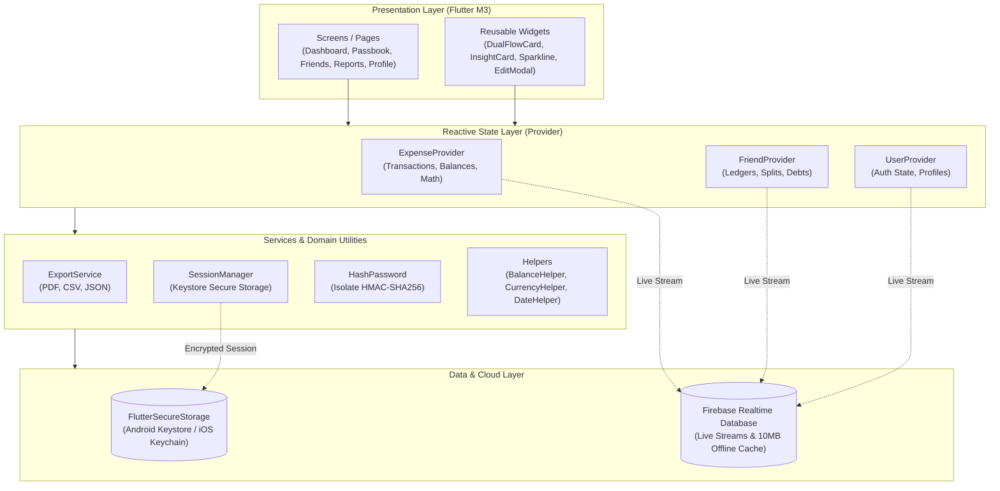
```mermaid
flowchart TD
    subgraph UI ["Presentation Layer (Flutter M3)"]
        A["Screens / Pages<br>(Dashboard, Passbook, Friends, Reports, Profile)"]
        B["Reusable Widgets<br>(DualFlowCard, InsightCard, Sparkline, EditModal)"]
    end

    subgraph State ["Reactive State Layer (Provider)"]
        C["ExpenseProvider<br>(Transactions, Balances, Math)"]
        D["FriendProvider<br>(Ledgers, Splits, Debts)"]
        E["UserProvider<br>(Auth State, Profiles)"]
    end

    subgraph Services ["Services & Domain Utilities"]
        F["ExportService<br>(PDF, CSV, JSON)"]
        G["SessionManager<br>(Keystore Secure Storage)"]
        H["HashPassword<br>(Isolate HMAC-SHA256)"]
        I["Helpers<br>(BalanceHelper, CurrencyHelper, DateHelper)"]
    end

    subgraph Data ["Data & Cloud Layer"]
        J[("Firebase Realtime Database<br>(Live Streams & 10MB Offline Cache)")]
        K[("FlutterSecureStorage<br>(Android Keystore / iOS Keychain)")]
    end

    A --> State
    B --> State
    State --> Services
    Services --> Data
    C -.->|Live Stream| J
    D -.->|Live Stream| J
    E -.->|Live Stream| J
    G -.->|Encrypted Session| K
```

---

### User Journey & Navigation Flow

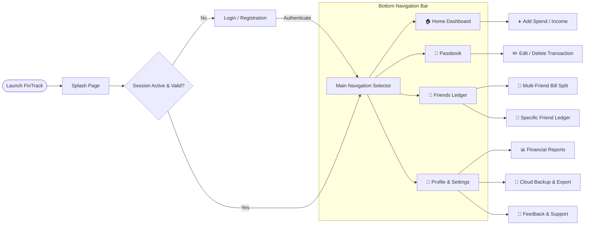
```mermaid
flowchart LR
    Start(["Launch FinTrack"]) --> Splash["Splash Page"]
    Splash --> Verify{"Session Active & Valid?"}
    
    Verify -- "No" --> Auth["Login / Registration"]
    Auth -->|Authenticate| NavSelector["Main Navigation Selector"]
    Verify -- "Yes" --> NavSelector

    subgraph BottomNav ["Bottom Navigation Bar"]
        NavSelector --> Tab1["🏠 Home Dashboard"]
        NavSelector --> Tab2["📒 Passbook"]
        NavSelector --> Tab3["👥 Friends Ledger"]
        NavSelector --> Tab4["👤 Profile & Settings"]
    end

    Tab1 --> AddModal["➕ Add Spend / Income"]
    Tab2 --> EditModal["✏️ Edit / Delete Transaction"]
    Tab3 --> SplitModal["🍕 Multi-Friend Bill Split"]
    Tab3 --> FriendDetail["👤 Specific Friend Ledger"]
    Tab4 --> Reports["📊 Financial Reports"]
    Tab4 --> Backup["💾 Cloud Backup & Export"]
    Tab4 --> Feedback["💬 Feedback & Support"]
```

---

### Atomic Bill Splitting Data Flow

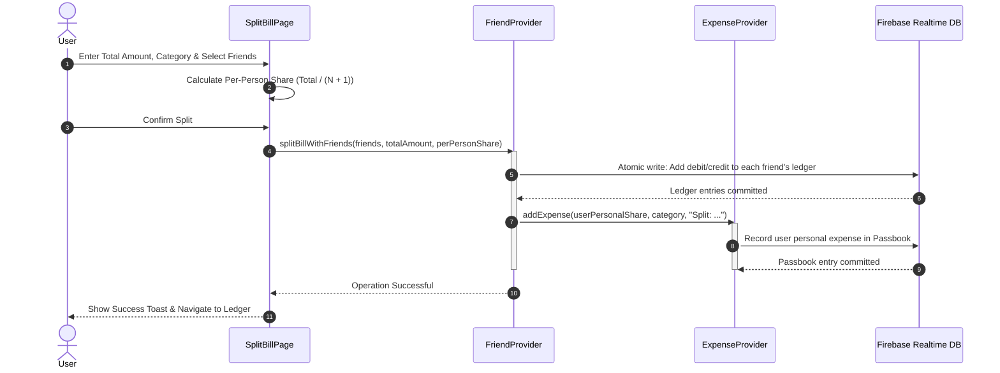
```mermaid
sequenceDiagram
    autonumber
    actor User as User
    participant UI as SplitBillPage
    participant FP as FriendProvider
    participant EP as ExpenseProvider
    participant DB as Firebase Realtime DB

    User->>UI: Enter Total Amount, Category & Select Friends
    UI->>UI: Calculate Per-Person Share (Total / (N + 1))
    User->>UI: Confirm Split
    UI->>FP: splitBillWithFriends(friends, totalAmount, perPersonShare)
    activate FP
    FP->>DB: Atomic write: Add debit/credit to each friend's ledger
    DB-->>FP: Ledger entries committed
    FP->>EP: addExpense(userPersonalShare, category, "Split: ...")
    activate EP
    EP->>DB: Record user personal expense in Passbook
    DB-->>EP: Passbook entry committed
    deactivate EP
    deactivate FP
    FP-->>UI: Operation Successful
    UI-->>User: Show Success Toast & Navigate to Ledger
```

---

### Security & Authentication Lifecycle

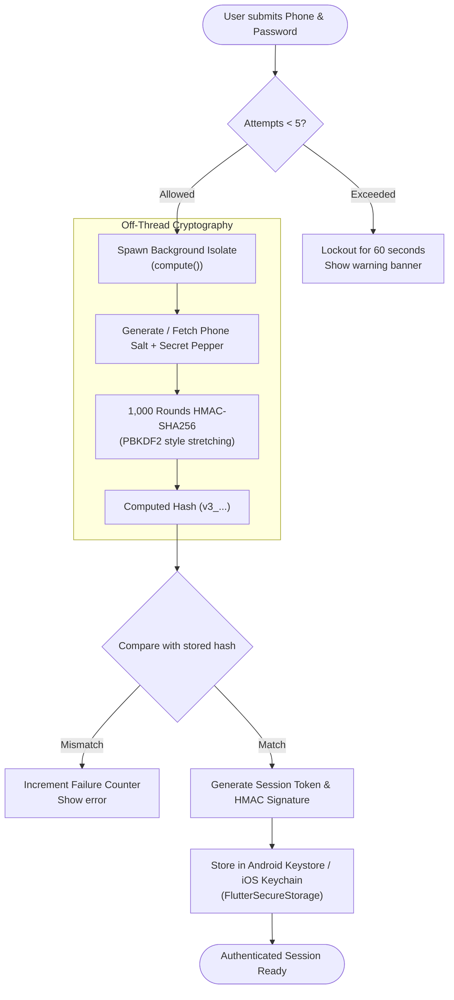
```mermaid
flowchart TD
    User(["User submits Phone & Password"]) --> Lockout{"Attempts < 5?"}
    Lockout -- "Exceeded" --> Block["Lockout for 60 seconds<br>Show warning banner"]
    Lockout -- "Allowed" --> Isolate["Spawn Background Isolate<br>(compute())"]
    
    subgraph Crypto ["Off-Thread Cryptography"]
        Isolate --> Salt["Generate / Fetch Phone Salt + Secret Pepper"]
        Salt --> Stretching["1,000 Rounds HMAC-SHA256<br>(PBKDF2 style stretching)"]
        Stretching --> HashResult["Computed Hash (v3_...)"]
    end

    HashResult --> Verify{"Compare with stored hash"}
    Verify -- "Mismatch" --> IncFail["Increment Failure Counter<br>Show error"]
    Verify -- "Match" --> GenToken["Generate Session Token & HMAC Signature"]
    GenToken --> Keystore["Store in Android Keystore / iOS Keychain<br>(FlutterSecureStorage)"]
    Keystore --> Ready(["Authenticated Session Ready"])
```

---

## 📂 Project Directory Structure

```text
account/
├── android/                           # Android native configuration, Gradle scripts & Keystore
├── assets/                            # Images, logos, and custom icons
├── ios/                               # iOS native workspace & configuration
├── lib/                               # Primary Dart / Flutter application source code
│   ├── authentication/                # Authentication screens & verification
│   │   ├── login_page.dart            # Login screen with brute-force lockout handling
│   │   └── registration_page.dart     # Registration screen with password complexity policy
│   │
│   ├── friends_pages/                 # Friend ledgers & bill splitting
│   │   ├── add_friends.dart           # Add new friend modal dialog
│   │   ├── add_friend_spent.dart      # Record direct friend transaction (Lent / Borrowed)
│   │   ├── friend_expenses.dart       # Main friend ledger list with "You Get" & "You Owe"
│   │   ├── specific_friend_page.dart  # Detailed friend transaction history & PDF export
│   │   └── split_bill_page.dart       # Atomic multi-friend bill splitting engine
│   │
│   ├── get_information/               # Cryptography, secure storage & session management
│   │   ├── get_user_detail.dart       # User details retrieval & session binding
│   │   ├── hash_password.dart         # 1,000-round HMAC-SHA256 off-thread password hashing
│   │   └── session_manager.dart       # Hardware-backed Keystore session persistence
│   │
│   ├── profile_pages/                 # Profile, settings, analytics & export screens
│   │   ├── change_password_page.dart  # Secure password reset with old password verification
│   │   ├── data_backup_page.dart      # Multi-format backup & export hub (JSON, CSV, PDF)
│   │   ├── edit_information_page.dart # Update user name, email, phone, and address
│   │   ├── feedback_page.dart         # In-app 5-star rating and issue reporting
│   │   ├── personal_information_page.dart # Account profile overview & stats
│   │   ├── report_page.dart           # Visual reports, FL Chart analytics & Health Score
│   │   └── terms_and_privacy_page.dart# In-app terms of service and privacy disclosure
│   │
│   ├── providers/                     # Reactive state management (ChangeNotifiers)
│   │   ├── expense_provider.dart      # Transactions, category math, running balance streams
│   │   ├── friend_provider.dart       # Friends list, debt calculations, atomic split transactions
│   │   └── user_provider.dart         # Current user authentication & profile state
│   │
│   ├── services/                      # Application domain services
│   │   └── export_service.dart        # Vector PDF builder, CSV generator, and JSON exporter
│   │
│   ├── splash/                        # Application bootstrap
│   │   └── splash_page.dart           # Animated splash screen with session verification
│   │
│   ├── user_pages/                    # Core user navigation & transaction screens
│   │   ├── add_spent.dart             # Add expense / income modal sheet
│   │   ├── main_page.dart             # Dashboard with dual-wallet summary & insights
│   │   ├── passbook_page.dart         # Paginated passbook, search, filters & sort
│   │   └── profile.dart               # Main profile tab with settings navigation tiles
│   │
│   ├── utils/                         # Reusable mathematical & formatting helpers
│   │   ├── balance_helper.dart        # Running balance calculation algorithms
│   │   ├── category_theme.dart        # Category color palettes, icons, and theme bindings
│   │   ├── currency_helper.dart       # Standard Indian Rupee (INR) formatting & parsing
│   │   └── date_helper.dart           # Zero-exception resilient date parser & formatter
│   │
│   ├── widgets/                       # Reusable presentation components
│   │   ├── confirm_dialog.dart        # Reusable modal confirmation dialog
│   │   ├── dual_flow_card.dart        # Inflow / Outflow balance card with delta trend
│   │   ├── edit_expense_modal.dart    # Full-featured inline transaction editor
│   │   ├── error_retry_widget.dart    # Network failure placeholder with retry action
│   │   ├── export_statement_modal.dart# Date-range statement export bottom sheet
│   │   ├── insight_card.dart          # Dashboard metric card
│   │   ├── month_carousel.dart        # Horizontal month-picker carousel
│   │   ├── passbook_transaction_tile.dart # Rich transaction item with edit & category pills
│   │   ├── smart_insight_banner.dart  # Offline status and sync warning banner
│   │   └── sparkline_painter.dart     # Custom painter for financial sparkline charts
│   │
│   ├── firebase_options.dart          # Auto-generated FlutterFire platform credentials
│   ├── main.dart                      # Application entrypoint & offline cache configuration
│   └── nav_bar.dart                   # Bottom navigation bar with PopScope back-button handling
│
├── screenshots/                       # High-resolution production app screenshots & banner
│   ├── banner.png                     # Ultra-wide high-definition repository hero banner
│   ├── 01_splash_screen.jpeg
│   ├── 02_home_dashboard.jpeg
│   ├── 03_passbook_ledger.jpeg
│   ├── 04_friends_split_ledger.jpeg
│   ├── 05_reports_overview.jpeg
│   ├── 06_reports_visual_charts.jpeg
│   ├── 07_profile_and_settings.jpeg
│   ├── 08_personal_information.jpeg
│   ├── 09_cloud_backup_and_export.jpeg
│   └── 10_feedback_and_support.jpeg
│
├── test/                              # Automated test suite (62 Passing Tests)
│   ├── security/                      # Cryptography and session unit tests
│   │   ├── hash_password_test.dart
│   │   └── session_manager_test.dart
│   ├── services/                      # Data export and generation tests
│   │   └── export_service_test.dart
│   ├── utils/                         # Mathematical and utility tests
│   │   ├── balance_helper_test.dart
│   │   ├── currency_helper_test.dart
│   │   ├── date_helper_test.dart
│   │   └── split_helper_test.dart
│   └── widgets/                       # Widget and UI integration tests
│       ├── data_backup_page_test.dart
│       ├── edit_expense_modal_test.dart
│       ├── error_retry_widget_test.dart
│       ├── export_statement_modal_test.dart
│       ├── feedback_page_test.dart
│       ├── nav_bar_test.dart
│       ├── profile_page_test.dart
│       ├── report_page_test.dart
│       ├── split_bill_page_test.dart
│       └── terms_and_privacy_page_test.dart
│
├── pubspec.yaml                       # Dependencies, assets & Flutter environment
└── README.md                          # Comprehensive project documentation
```

---

## 🚀 Tech Stack & Dependencies

| Technology / Package | Version | Purpose in FinTrack |
|---|---|---|
| **[Flutter SDK](https://flutter.dev)** | `^3.24.0` | Cross-platform UI development framework |
| **[Dart SDK](https://dart.dev)** | `^3.5.0` | Modern, null-safe client-optimized programming language |
| **[Firebase Database](https://pub.dev/packages/firebase_database)** | `^11.0.0` | Real-time cloud synchronization & 10MB offline disk persistence |
| **[Firebase Core](https://pub.dev/packages/firebase_core)** | `^3.0.0` | Core Firebase app initialization and configuration |
| **[Firebase Auth](https://pub.dev/packages/firebase_auth)** | `^5.0.0` | Anonymous session credentials for secure database rule enforcement |
| **[Provider](https://pub.dev/packages/provider)** | `^6.1.2` | Clean, reactive state management across all app domains |
| **[Flutter Secure Storage](https://pub.dev/packages/flutter_secure_storage)** | `^9.2.2` | Hardware-backed session tokens via Android Keystore / iOS Keychain |
| **[FL Chart](https://pub.dev/packages/fl_chart)** | `^0.68.0` | Beautiful, performant bar charts and donut charts |
| **[PDF](https://pub.dev/packages/pdf)** | `^3.10.8` | Vector PDF document generation for passbooks and statements |
| **[Printing](https://pub.dev/packages/printing)** | `^5.13.2` | Cross-platform print dialog, document sharing, and preview sheet |
| **[Crypto](https://pub.dev/packages/crypto)** | `^3.0.3` | Cryptographic primitives for HMAC-SHA256 password stretching |
| **[Intl](https://pub.dev/packages/intl)** | `^0.19.0` | Currency localization and date parsing |

---

## ⚡ Getting Started

### Prerequisites
Before running FinTrack, ensure you have:
1. **[Flutter SDK](https://docs.flutter.dev/get-started/install)** (v3.24.0 or later).
2. **Android Studio** or **VS Code** with Flutter and Dart extensions installed.
3. An active Android Device or Android Virtual Device (AVD) running API level 24+.
4. A Google Firebase project with **Realtime Database** enabled.

---

### Installation & Setup

1. **Clone the repository:**
   ```bash
   git clone https://github.com/VishalNakum1210/FinTrack.git
   cd FinTrack
   ```

2. **Install Flutter packages:**
   ```bash
   flutter pub get
   ```

3. **Verify Flutter environment:**
   ```bash
   flutter doctor
   ```

---

### Firebase Setup

1. Enable **Realtime Database** in test/production mode in your Firebase Console.
2. Enable **Anonymous Authentication** under *Firebase Console > Build > Authentication > Sign-in method*.
3. Add your `google-services.json` file inside `android/app/` or generate `lib/firebase_options.dart` using the FlutterFire CLI:
   ```bash
   flutterfire configure
   ```
4. Set up Realtime Database security rules:
   ```json
   {
     "rules": {
       "users": {
         "$uid": {
           ".read": "auth != null",
           ".write": "auth != null"
         }
       },
       "feedback": {
         ".read": "auth != null",
         ".write": true
       }
     }
   }
   ```

---

## 🧪 Testing & Quality Assurance

FinTrack includes a comprehensive test suite of **62 automated unit, security, and widget tests** covering all critical business logic and UI interactions.

### Run All Tests:
```bash
flutter test
```

### Test Suite Breakdown:
- 🔒 **Security Tests** (`test/security/`): Validates password complexity, off-thread isolate hashing, session token integrity, and user persistence across app restarts.
- 📐 **Math & Utilities** (`test/utils/`): Verifies running balance math, zero-exception date parsing, and Indian Rupee currency formatting.
- 📄 **Export Service** (`test/services/`): Tests PDF vector statement building, CSV spreadsheet data generation, and complete JSON cloud serialization.
- 📱 **Widget & UI Integration** (`test/widgets/`): Covers Navigation bar switching, PopScope back-button logic, Edit Expense modals, Financial Report charts, and Feedback form validation.

---

## 📦 Production APK Downloads

Pre-built, signed production APKs are located under `build/app/outputs/flutter-apk/`:

| Package | Target Architecture | Typical Size | Compatibility |
|---|---|---|---|
| **`app-arm64-v8a-release.apk`** | 64-bit ARM | **~21 MB** | **Recommended.** Optimized for 99% of modern Android phones. |
| **`app-armeabi-v7a-release.apk`** | 32-bit ARM | **~19 MB** | For older legacy Android hardware. |
| **`app-release.apk`** | Universal | **~57 MB** | Contains all binaries for any Android architecture. |

### How to Build From Source:
```bash
# Build split architecture APKs (optimized size)
flutter build apk --release --split-per-abi

# Build universal APK
flutter build apk --release
```

---

## 🛡 Security Best Practices

FinTrack follows strict mobile security guidelines:
- 🔑 **No Plaintext Passwords**: Passwords are never transmitted or stored in plaintext. They undergo 1,000 rounds of HMAC-SHA256 hashing with individual user salts.
- ⚡ **No UI Thread Freezing**: All intensive hashing computations are offloaded to background threads using Flutter's `compute()`.
- 🔐 **Keystore Backed Sessions**: Auth tokens and usernames are stored inside Android Keystore / iOS Keychain.
- ⏱️ **Brute-Force Throttling**: 5-attempt rate limiter locks the login form for 60 seconds after repeated failed credentials.
- 🛡️ **Zero-Credential Git Policy**: Production signing keystores and private credentials (`key.properties`, private configs) are strictly excluded via `.gitignore`.

---

## 👨‍💻 Author & Contributions

<div align="center">

  <h3>Vishal Nakum</h3>
  <p>Flutter Developer • Mobile Architecture Enthusiast</p>

  <p>
    <a href="https://github.com/VishalNakum1210"></a>
    <a href="mailto:vishal7228918826@gmail.com"></a>
  </p>

  <br>

  <p><b>Show your support by giving this project a ⭐️ on GitHub!</b></p>
  <a href="https://github.com/VishalNakum1210/FinTrack">
    
  </a>

  <br><br>
  <sub>Built with 💚 using Flutter & Firebase</sub>

</div>
